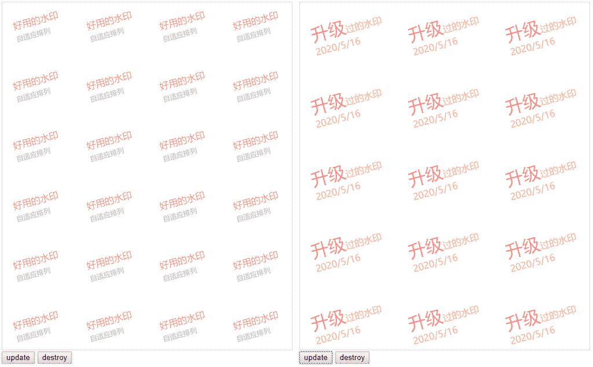

# dom-mark
[![NPM version][npm-image]][npm-url] | 
[中文文档](README_zh.md)

[npm-image]: https://img.shields.io/npm/v/@funinps/dom-mark.svg?style=flat-square
[npm-url]: https://www.npmjs.com/package/@funinps/dom-mark

Add text/HTML as watermark to DOM node

- automatically calculate size and position
- 4kb mini library
- support IE 9+ and all mobile browser
- customizable HTML content and style
- observe dom changes and rerender with MutationObserver

## Demo
[ESM](demo/esm.html) | [UMD](demo/umd.html) | [mobile](demo/mobile.html)



## Install
```bash
npm i @funinps/dom-mark -S
# or
yarn add @funinps/dom-mark
```
In browser, download `dist/dom-mark.js` to your project:
```html
<script src="/path/to/dom-mark.js"></script>
```

## Useage
```javascript
import DomMark from '@funinps/dom-mark'

const domMark = new DomMark('body', {
  content: '水印', // html,text
  fontSize: 'inherit',
  fontFamily: 'inherit',
  color: 'inherit',
  opacity: .3,
  padding: 20,
  zIndex: 6000,
  minMargin: [40, 20],
  rotate: -15,
  observe: true
})

domMark.render()
```
### update:
```javascript
domMark.update({
  content: ''
})
```
**important: if you want to use `setInterval` or `setTimeout` to update, don't forget `clearInterval` or `clearTimeout`, otherwise maybe it will cause a crash(e.g. webpack HMR)**
### destroy:
```javascript
domMark.destroy()
```

## API
```javascript
const dm = new DomMark(selector, options)
dm.render()
dm.update(options)
dm.destroy()
```

`selector` can be a HTMLElement object or document.querySelector's parameter, default: `body`

### options
| option | type | default | introduction |
|:------|:-------|:--------------------------|:----|
| content | String | - | HTML string or text |
| fontSize | String | inherit | font size, e.g. 16px,2rem  |
| fontFamily | String | inherit | font family |
| color | String | inherit | font color |
| opacity | Number | .3 | opacity of content, 0~1 |
| padding | Number | 20 | the parent element padding, unit: px |
| zIndex | Number | 6000 | z-index of centent |
| minMargin | Array | [40, 20] | [vertical, horizontal], margin of item unit: px |
| rotate | Number | -15 | rotation angle of item |
| observe | Boolean | true | observe the dom change and rerender, prevent user delete watermarks, work with `MutationObserver`, see [caniuse](https://caniuse.com/#search=MutationObserver) |

## Change log
#### v1.1.0 2020/05/17
rerender when hot module reload, rerender only when watermark change in MutationObserver

## Questions & Suggestions

Please open an issue [here](https://github.com/funinps/dom-mark/issues).

## License

[MIT](LICENSE)